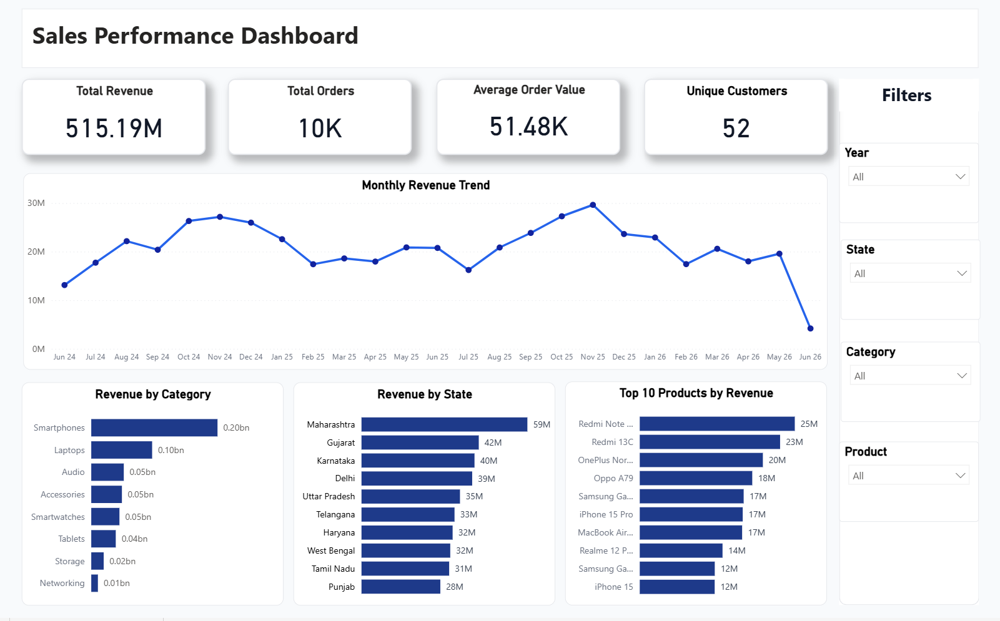
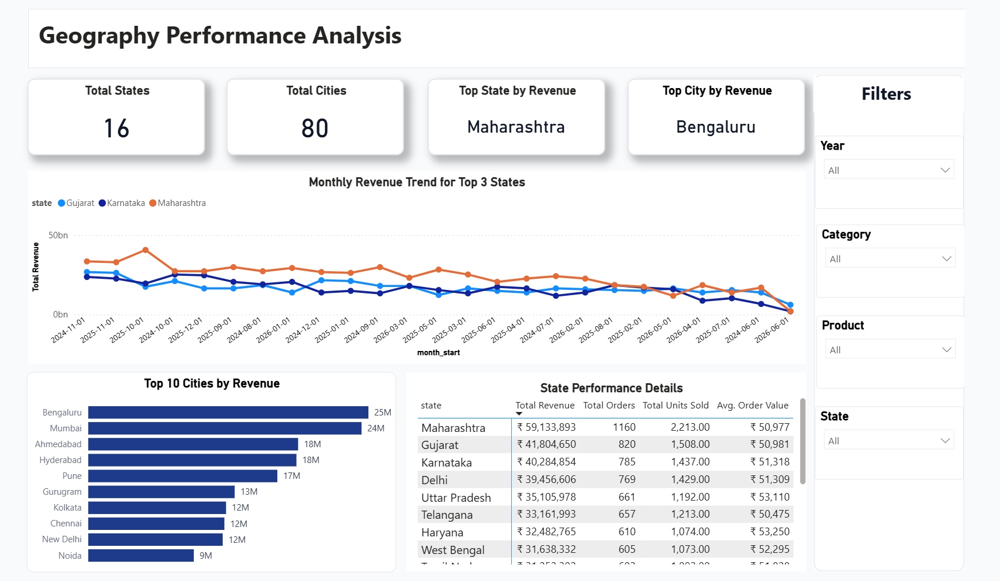
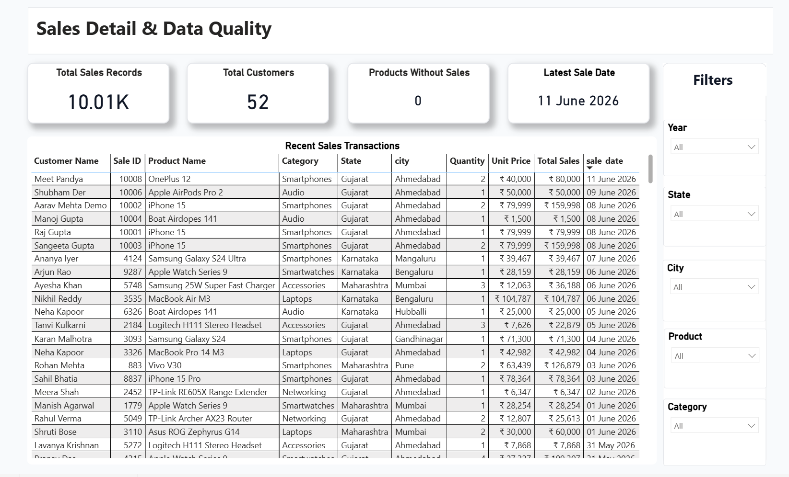

# Sales Analytics Dashboard

An end-to-end Sales Analytics Learning System that demonstrates how sales data moves from operational entry to business reporting.

This is a self-built learning and portfolio project using sample sales data. The goal is not only to build a dashboard, but to understand the complete data journey:

```text
React Frontend -> Flask Backend API -> MySQL Database -> SQL Analytics Views -> Power BI Dashboard -> PDF Report / Portfolio Output
```

## Project Objective

This project was built to understand a real-world analytics workflow from data entry to reporting. It shows how business sales data can be entered through a frontend form, processed by backend APIs, stored in a relational database, transformed into analytics-ready SQL views, and visualized in Power BI.

The project connects operational application development with business intelligence reporting so the full data lifecycle is visible in one place.

## End-to-End Data Flow

1. A user enters sales data in the React Sales Entry form.
2. React fetches product master data from MySQL through `GET /api/products`.
3. React submits new sales transactions through `POST /api/sales`.
4. The Flask backend validates the request payload.
5. The backend inserts valid sales records into the MySQL `sales` table.
6. MySQL stores product master data and sales transaction data.
7. SQL views create an analytics-ready layer for reporting.
8. Power BI connects to MySQL using a MySQL/ODBC connection.
9. The Power BI dashboard visualizes KPIs, trends, product performance, geography performance, and recent transactions.
10. Newly inserted frontend data becomes available in Power BI after refreshing the report data.

## Tech Stack

| Layer | Technology |
| --- | --- |
| Frontend | React, Tailwind CSS, Axios |
| Backend | Python Flask |
| Database | MySQL |
| Analytics | SQL, SQL Views |
| BI Tool | Power BI |
| Tools | MySQL Workbench, Power BI Desktop, Power BI Service, VS Code |
| Version Control | GitHub |

## Folder Structure

Actual project structure:

```text
Project/
+-- backend/
|   +-- app/
|   |   +-- models/
|   |   +-- routes/
|   |   +-- utils/
|   +-- requirements.txt
|   +-- run.py
+-- data/
|   +-- products.csv
|   +-- sales.csv
+-- database/
|   +-- analytics/
|   |   +-- analytics_queries.sql
|   |   +-- views.sql
|   |   +-- monthly_revenue.sql
|   |   +-- recent_sales.sql
|   |   +-- sales_by_category.sql
|   |   +-- sales_by_state.sql
|   |   +-- top_cities.sql
|   |   +-- top_products.sql
|   +-- schema/
|   |   +-- 01_create_products.sql
|   |   +-- 02_create_sales.sql
|   +-- seeds/
|       +-- products_seed.sql
|       +-- sales_seed.sql
+-- frontend/
|   +-- src/
|   |   +-- api/
|   |   +-- components/
|   |   +-- pages/
|   +-- package.json
|   +-- vite.config.js
+-- powerbi/
|   +-- Scrrenshots/
|   |   +-- Executive_Dashboard.png
|   |   +-- Geography_Performance.png
|   |   +-- Product & Category.png
|   |   +-- Sales_Details.png
|   +-- Sales_Analytics_Dashboard.pbix
|   +-- Sales_Analytics_Dashboard.pdf
+-- PROJECT_CONTEXT.md
+-- README.md
```

## Frontend Features

The frontend is a React application designed to demonstrate operational data entry and analytics exploration.

- Sales Entry form for creating new sales transactions.
- Sales Records page for viewing stored sales data.
- Product analytics page for product-level information.
- Live dashboard page for high-level frontend analytics.
- Analytics guide/preview page for explaining reporting concepts.
- Product dropdowns use product master data fetched from MySQL through the backend.
- Sales entries are submitted to the Flask backend API.
- Form behavior demonstrates frontend validation and operational data capture.

Frontend URL:

```text
http://127.0.0.1:5173
```

## Backend Features

The backend is a Flask API layer used by the React frontend. It connects to MySQL, validates sales data, and handles CRUD operations for sales records.

Available APIs:

| Method | Endpoint | Purpose |
| --- | --- | --- |
| GET | `/api/health` | Health check for the backend |
| GET | `/api/products` | Fetch product master data |
| GET | `/api/sales` | Fetch paginated sales records |
| GET | `/api/sales/<id>` | Fetch one sales record |
| POST | `/api/sales` | Create a new sales record |
| PUT | `/api/sales/<id>` | Update an existing sales record |
| DELETE | `/api/sales/<id>` | Delete a sales record |

Backend URL:

```text
http://127.0.0.1:5000
```

Health check:

```text
http://127.0.0.1:5000/api/health
```

## Database Design

The MySQL database is named:

```text
sales_analytics
```

### products table

The `products` table stores product master data.

| Column | Description |
| --- | --- |
| `product_id` | Product primary key |
| `product_name` | Product name |
| `category` | Product category |

The sample product data contains 80 product records.

### sales table

The `sales` table stores transaction-level sales data.

| Column | Description |
| --- | --- |
| `sale_id` | Sales transaction primary key |
| `customer_name` | Customer name |
| `product_id` | Foreign key connected to `products.product_id` |
| `quantity` | Units sold |
| `unit_price` | Unit selling price |
| `total_sales` | Calculated sales amount |
| `state` | Customer/sale state |
| `city` | Customer/sale city |
| `sale_date` | Sales transaction date |
| `created_at` | Record creation timestamp |

The sample sales data contains 10,000 sales records. New records created from the frontend are inserted into the same `sales` table, so the reporting dataset can grow beyond the seed data.

## SQL Analytics Layer

The SQL analytics layer is stored in:

- `database/analytics/views.sql`
- `database/analytics/analytics_queries.sql`

`views.sql` creates reusable analytics-ready views for Power BI and SQL analysis. These views simplify reporting by joining product and sales data, preparing KPI summaries, and aggregating performance across time, product, category, state, and city.

Important SQL views:

- `vw_sales_enriched`
- `vw_kpi_summary`
- `vw_monthly_sales`
- `vw_product_performance`
- `vw_category_performance`
- `vw_state_performance`
- `vw_city_performance`
- `vw_products_without_sales`
- `vw_product_state_performance`
- `vw_category_state_performance`

SQL concepts used:

- `JOIN`
- `GROUP BY`
- Aggregations
- Reusable SQL views
- Subqueries for staged calculations
- Window functions
- Running totals
- Month-over-month analysis
- Data enrichment views

## Power BI Dashboard

The Power BI dashboard contains 4 report pages.

### Page 1: Executive Dashboard

Purpose: Overall sales performance.

Includes:

- Total Revenue
- Total Orders
- Average Order Value
- Unique Customers
- Monthly Revenue Trend
- Revenue by Category
- Revenue by State
- Top 10 Products by Revenue

### Page 2: Products & Category Analysis

Purpose: Product and category performance.

Includes:

- Total Products
- Active Products
- Total Units Sold
- Average Unit Price
- Revenue by Category
- Category Performance Details
- Top 10 Products by Orders
- Top 10 Products by Revenue

### Page 3: Geography Performance Analysis

Purpose: State and city level sales analysis.

Includes:

- Total States
- Total Cities
- Top State by Revenue
- Top City by Revenue
- Monthly Revenue Trend for Top 3 States
- Top 10 Cities by Revenue
- State Performance Details

### Page 4: Sales Detail & Data Quality

Purpose: Transaction-level validation and data quality proof.

Includes:

- Total Sales Records
- Total Customers
- Products Without Sales
- Latest Sale Date
- Recent Sales Transactions table
- Filters for year, state, city, product, and category

This page proves the end-to-end flow from frontend sales entry to MySQL storage to Power BI reporting after refresh.

## Dashboard Screenshots

### Executive Dashboard



### Products & Category Analysis


### Geography Performance Analysis



### Sales Detail & Data Quality



## Power BI Files

- `powerbi/Sales_Analytics_Dashboard.pbix`
- `powerbi/Sales_Analytics_Dashboard.pdf`

The PBIX file contains the editable Power BI dashboard. The PDF file contains exported report pages for quick viewing and portfolio sharing.

## How to Run Backend

From the project root:

```powershell
cd backend
python -m venv .venv
.\.venv\Scripts\Activate.ps1
pip install -r requirements.txt
python run.py
```

Backend URL:

```text
http://127.0.0.1:5000
```

API health check:

```text
http://127.0.0.1:5000/api/health
```

## How to Run Frontend

From the project root:

```powershell
cd frontend
npm install
npm run dev
```

Frontend URL:

```text
http://127.0.0.1:5173
```

## How to Use Power BI

1. Open `powerbi/Sales_Analytics_Dashboard.pbix` in Power BI Desktop.
2. Ensure the MySQL Server is running.
3. Confirm the MySQL connection points to the `sales_analytics` database.
4. Refresh the data in Power BI Desktop.
5. Export to PDF if required.

For Power BI Service scheduled refresh with a local MySQL database, an on-premises data gateway is required. Gateway setup can be added as a future improvement.

## Key Business Questions Answered

- What is the total revenue?
- How many orders were generated?
- What is the average order value?
- Which products generate the highest revenue?
- Which products receive the highest order volume?
- Which categories perform best?
- Which states and cities contribute most revenue?
- How does revenue trend over time?
- Are there products without sales?
- Are recent frontend transactions visible in reporting?

## Key Learnings

- End-to-end data flow from entry to reporting.
- Frontend to backend API integration.
- MySQL database design using product and sales tables.
- SQL views for analytics-ready reporting layers.
- Power BI dashboard design.
- KPI calculation and validation.
- Product and geography performance analysis.
- Data validation from source entry to reporting layer.
- Power BI refresh workflow.

## Known Limitation / Future Improvement

The current Power BI report uses multiple SQL views such as `vw_sales_enriched`, `vw_state_performance`, `vw_category_performance`, `vw_product_performance`, and other aggregated views. Some slicers may not cross-filter every visual because all views are not connected through a complete star-schema relationship model.

Future improvements:

- Build a proper Power BI star schema.
- Use `vw_sales_enriched` as the central fact table.
- Create dimension tables such as `Dim_Date`, `Dim_Product`, `Dim_Category`, `Dim_State`, and `Dim_City`.
- Create DAX measures from the central fact table.
- Improve complete cross-filtering across all report pages.
- Configure Power BI Gateway for scheduled refresh from local MySQL.
- Add profit/margin metrics after adding `cost_price` or profit fields.
- Deploy the frontend and backend.

## Final Project Status

- Frontend completed.
- Backend completed.
- MySQL database completed.
- SQL schema and seed files completed.
- SQL analytics views completed.
- Power BI dashboard completed.
- PDF report exported.
- Screenshots added.
- README created.

## Short Portfolio Summary

This project demonstrates my ability to build an end-to-end analytics workflow covering data entry, backend APIs, database design, SQL analytics, Power BI reporting, and project documentation.
